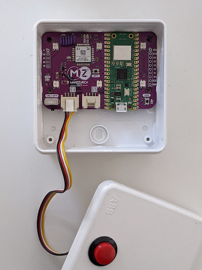

# Getting Started

## Hardware
* Raspberry Pi Pico W (W stands for Wi-Fi)
* Seed Studio LoRa E5, Pin GP4 + GP5
* 6 Neopixels on Pin GP22
* 1 LED on Pin GP8
* 1 Button on Pin GP6
* 4 expansion ports (Grove)
* 1 PicoW onboard LED, Pin LED

## Installing CircuitPython
1. Download the uf2 file from https://circuitpython.org/board/raspberry_pi_pico_w/
1. While holding the white "BOOTSEL" button connect the pico W to your computer, it should mount as "RPI-RP2"
2. Copy the circuitpython uf2 file onto it
3. After it is done the pico W will mount as "CIRCUITPY"

## Getting the library
Lots of existing libraries are bundled in the zip, which you can copy paste to your PicoW lib folder.

1. Download v8 from https://circuitpython.org/libraries

> To prevent mistakes I recommend to delete the folders lib/adafruit_featherwing and lib/adafruit_seesaw

# LoRa

## Setting up LoRa OTAA
1. visit the things network EU console https://eu1.cloud.thethings.network/console/
2. you may need to create an account first
3. Create a new application with the name "makezurch-badge-2023-YOURNAME"
4. On your pico run `AT+ID` to get the AppEui (also referenced as JoinEUI), DevEui, DevAddr
4. Register end device
    * manual
    * frequency plan: Europe SF9 863-870
    * LoRa version 1.0.3
    * for JoinEUI fill in the AppEUI
5. Configure LoRa with the value from Activation Information > AppKey
   1. AT+KEY=APPKEY,"AppKey"


## Setting up LoRa ABP
1. visit the things network EU console https://eu1.cloud.thethings.network/console/
2. you may need to create an account first
3. Create a new application with the name "makezurch-badge-2023-YOURNAME"
4. Get the AppEui (also referenced as JoinEUI), DevEui, DevAddr
5. Create an endpoint
    * manual
    * frequency plan Europe SF9 863-870
    * LoRa version 1.0.3
6. Configure LoRa with the values from Session information section
   1. AT+ID=DevAddr,"Device address"
   2. AT+KEY=NWKSKEY,"NwkSKey"


## Sending Packages
We use the UART port on pin 4 and 5 to write AT commands to the "Seed Studio LoRa E5".
It uses LoRa Version 1.0.3.

> If you want to play with the AT commands yourself see example 05-lora/serial-debug.py

To set it up

```bash
AT+ID
# -> Use this info to configure end device in console
AT+DR=3 # 3 uses EU868 SF9
AT+CH=NUM,0-2 # no idea what channel to choose
AT+MODE=LWOTAA  # LWOTAA, LWABP
AT+KEY=APPKEY,"YOUR_APP_KEY_HERE"
AT+CLASS=A
AT+PORT=8
AT+JOIN
AT+CMSG="Hello"

```
ABP vs OTAA https://www.thethingsindustries.com/docs/devices/abp-vs-otaa/#otaa
[Documentation](https://files.seeedstudio.com/products/317990687/res/LoRa-E5%20AT%20Command%20Specification_V1.0%20.pdf)

# Knowledge

## Connecting to Serial
on macOS:
```bash
screen /dev/tty.usbmodemXXX 115200
```

## CircuitPython vs Micropython
`import machine` is used by micropython

# Hardware

## AP9 box
The MakeZurich Badge fits into a standard AP9 box (80x80x35mm).



## Matrix Keypad
https://learn.adafruit.com/matrix-keypad/pinouts

# Questions
* Are the lora configuration values channel, mode, class, appkey persisted?
  * AT+DR is stored
  * AT+MODE is stored
  * class can be stored with: AT+CLASS=A,SAVE (default is A)
  * AT-PORT is stored
  * AT+KEY is stored

* How to measure RSSI, is there a command?
* What is a good RSSI?
* Why is OTAA better than ABP? [link](https://www.thethingsindustries.com/docs/devices/abp-vs-otaa/#otaa)
* What does the package "supervisor" do? It is used to receive data over serial, while being plugged into USB.
